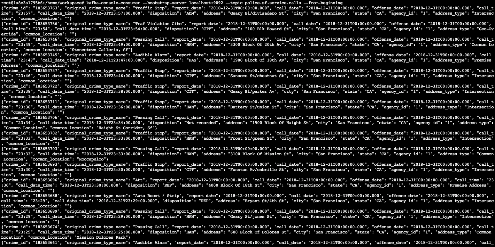
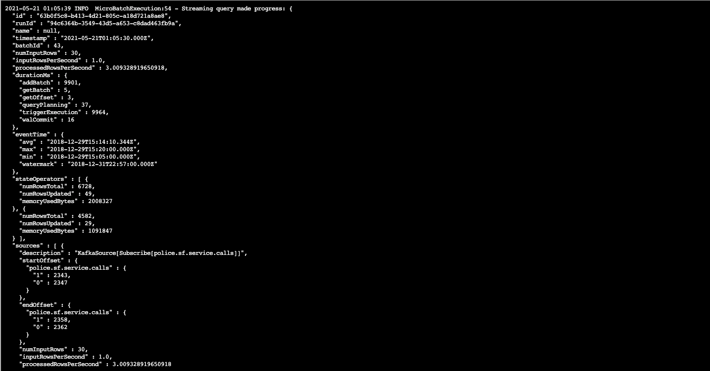
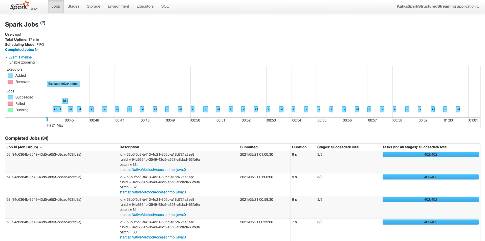

# SF Crime Statistics

## Project Overview
In this project, you will be provided with a real-world dataset, extracted from Kaggle, on San Francisco crime incidents, and you will provide statistical analyses of the data using Apache Spark Structured Streaming. You will draw on the skills and knowledge you've learned in this course to create a Kafka server to produce data, and ingest data through Spark Structured Streaming.

You can try to answer the following questions with the dataset:

What are the top types of crimes in San Fransisco?
What is the crime density by location?

### Development Environment
You may choose to create your project in the workspace we provide here, or if you wish to develop your project locally, you will need to set up your environment properly as described below:

Spark 2.4.3
Scala 2.11.x
Java 1.8.x
Kafka build with Scala 2.11.x
Python 3.6.x or 3.7.x
**Environment Setup (Only Necessary if You Want to Work on the Project Locally on Your Own Machine)**
For Macs or Linux:
- Download Spark from https://spark.apache.org/downloads.html. Choose "Prebuilt for Apache Hadoop 2.7 and later."
- Unpack Spark in one of your folders (I usually put all my dev requirements in /home/users/user/dev).
- Download binary for Kafka from this location https://kafka.apache.org/downloads, with Scala 2.11, version 2.3.0. Unzip in your local directory where you unzipped your Spark binary as well. Exploring the Kafka folder, you’ll see the scripts to execute in bin folders, and config files under config folder. You’ll need to modify zookeeper.properties and server.properties.
- Download Scala from the official site, or for Mac users, you can also use brew install scala, but make sure you download version 2.11.x.
- Run below to verify correct versions:
```
java -version
scala -version
```
- Make sure your ~/.bash_profile looks like below (might be different depending on your directory):
```bash
export SPARK_HOME=/Users/dev/spark-2.4.3-bin-hadoop2.7
export JAVA_HOME=/Library/Java/JavaVirtualMachines/jdk1.8.0_181.jdk/Contents/Home
export SCALA_HOME=/usr/local/scala/
export PATH=$JAVA_HOME/bin:$SPARK_HOME/bin:$SCALA_HOME/bin:$PATH
```
For Windows:
Please follow the directions found in this helpful StackOverflow post: https://stackoverflow.com/questions/25481325/how-to-set-up-spark-on-windows


## Project Directions
### Starter Code
You can find three Python files that are starter code, the project dataset, and some other necessary resources in a zip file called "SF Crime Data Project Files" in the Resources tab in the left sidebar of your classroom:
- producer_server.py
- kafka_server.py
- data_stream.py
- police-department-calls-for-service.json
- radio_code.json
- start.sh
- requirements.txt
These files are also included in the Project Workspace.

**Files You Need to Edit in Your Project Work**
These starter code files should be edited:

- producer_server.py
- data_stream.py
- kafka_server.py
The following file should be created separately for you to check if your kafka_server.py is working properly:
- consumer_server.py

**Create a GitHub Repository**
Create a new repo that will contain all these files for your project. You will submit a link to this repo as a key part of your project submission. If you complete the project in the classroom workspace here, just download the files you worked on and add them to your repo.

**Beginning the Project**
This project requires creating topics, starting Zookeeper and Kafka servers, and your Kafka bootstrap server. You’ll need to choose a port number (e.g., 9092, 9093..) for your Kafka topic, and come up with a Kafka topic name and modify the zookeeper.properties and server.properties appropriately.

**Local Environment**
- Install requirements using ./start.sh if you use conda for Python. If you use pip rather than conda, then use pip install -r requirements.txt.
- Use the commands below to start the Zookeeper and Kafka servers. You can find the bin and config folder in the Kafka binary that you have downloaded and unzipped.
```bash
bin/zookeeper-server-start.sh config/zookeeper.properties
bin/kafka-server-start.sh config/server.properties
```
- You can start the bootstrap server using this Python command: python producer_server.py.

**Workspace Environment**
- Modify the zookeeper.properties and producer.properties given to suit your topic and port number of your choice. Start up these servers in the terminal using the commands:
```bash
/usr/bin/zookeeper-server-start config/zookeeper.properties
/usr/bin/kafka-server-start config/server.properties

kafka-topics --create --zookeeper localhost:2181 --replication-factor 1 --partitions 2 --topic police.sf.service.calls

```
- You’ll need to open up two terminal tabs to execute each command.
- Install requirements using the provided ./start.sh script. This needs to be done every time you re-open the workspace, or anytime after you've refreshed, or woken up, or reset data, or used the "Get New Content" button in this workspace.
- In the terminal, to install other packages that you think are necessary to complete the project, use `conda install <package_name>`. You may need to reinstall these packages every time you re-open the workspace, or anytime after you've refreshed, or woken up, or reset data, or used the "Get New Content" button in this workspace.

### Step 1
- The first step is to build a simple Kafka server.
- Complete the code for the server in `producer_server.py` and `kafka_server.py`.
**Local Environment**
To see if you correctly implemented the server, use the command: `bin/kafka-console-consumer --bootstrap-server localhost:9092 --topic police.sf.service.calls --from-beginning` to see your output.
**Workspace Environment**
To start kafka-consumer-console, use the command `/usr/bin/kafka-consumer-console`.

Take a screenshot of your kafka-consumer-console output. You will need to include this screenshot as part of your project submission.


### Step 2
- Apache Spark already has an integration with Kafka brokers, so we would not normally need a separate Kafka consumer. However, we are going to ask you to create one anyway. Why? We'd like you to create the consumer to demonstrate your understanding of creating a complete Kafka Module (producer and consumer) from scratch. In production, you might have to create a dummy producer or consumer to just test out your theory and this will be great practice for that.
- Implement all the TODO items in data_stream.py. You may need to explore the dataset beforehand using a Jupyter Notebook.
- Do a spark-submit using this command: `spark-submit --packages org.apache.spark:spark-sql-kafka-0-10_2.11:2.3.4 --master local[*] data_stream.py`.

Take a screenshot of your progress reporter after executing a Spark job. You will need to include this screenshot as part of your project submission.


Take a screenshot of the Spark Streaming UI as the streaming continues. You will need to include this screenshot as part of your project submission.


### Step 3
Write the answers to these questions in the README.md doc of your GitHub repo:

1. How did changing values on the SparkSession property parameters affect the throughput and latency of the data?
   - We can change this 2 properties (maxOffsetsPerTrigger, maxRatePerPartition) that affect directly the streams. There are others refering to the executor and driver memory that are physically constrained and will limit the resources. So if we increase RAM, etc it will obviously help.
    - When we increase both maxOffsetsPerTrigger and maxRatePerPartition the througput increases, there are more rows processed per second. But it will consume more resources
    - maxFilesPerTrigger: maximum number of new files to be considered in every trigger (default: no max)
    - maxRatePerPartition: to set the maximum number of messages per partition per batch.
2. What were the 2-3 most efficient SparkSession property key/value pairs? Through testing multiple variations on values, how can you tell these were the most optimal?
   - I don't really know if they are optimal. I try some of them and what the Spark UI and the processedRowsPerSecond. They do not change a lot.
   - In fact, it is almost the same. I think that it depends a lot on the source and the source speed. Currently there is a sleep of 1 sec so I would expect 1 sample per second. And se if the spark stream can handle it running every 30 secs.
   - When seeing the Spark UI we see that it can handle the speed and there is some time left that it doesn't need to process. Maybe having that amount of "free" is good if the input rate increases more.
   - In conclusion, It depends on the input rate, and seeing if spark can handle that "expected" input with some margin accoridng to the application we may have running. Ex: At peak it could be 4x the speed so testing those edge cases may be appropiate so the app doesn't go down.
   - If changing the input rate, the 2 parameters from the last answer and the memory from executor and drivers may influence a lot on the capacity of spark to process it. If the spark cannot handle it, having more parellism and higher maxRatePerPartition and reading a bigger amount of samples per trigger (maxOffsetsPerTrigger) will help to increase or moderate the throughput.
   - Processed rows per second should be greater or equal to the input rows per second.


### Additional Resources
- [Structured Streaming Guide](http://spark.apache.org/docs/latest/structured-streaming-programming-guide.html#input-sources)
- [maxrateperpartition spark](https://stackoverflow.com/questions/41022367/set-spark-streaming-kafka-maxrateperpartition-for-createdirectstream)
- [StructuredStreaming + Kafka](http://spark.apache.org/docs/latest/structured-streaming-kafka-integration.html)